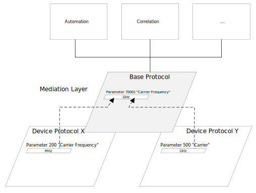

# About the DataMiner Mediation Layer

Often, in a particular infrastructure, you can find devices from different vendors that are almost identical: switches, IRDs, etc. Even though these devices share the same functionality, the implementation differs from one device to another. This is reflected in the protocols for these devices, for example, through different parameter names, different unit scales used (e.g. MHz vs. GHz), etc.

Through the DataMiner Mediation Layer, it is possible to provide a uniform view on these different devices/device protocols. This is achieved by using a so-called base protocol, which forms a mediation layer on top of device-specific protocols and therefore provides a standard view on these devices.

Automation scripts, for example, can then be based on these base protocols instead of on a device-specific protocol, so that these scripts can more easily be re-used.

The following graph illustrates the concept:

Suppose, for example, that "Device Protocol X" is a protocol for an IRD device X of vendor A, whereas "Device Protocol Y" is a protocol for an IRD device Y of vendor B. Both protocols have a parameter that holds the carrier frequency. However, the ID, description and unit of these parameters differ.

By defining a base protocol for IRD devices, we can provide a uniform, standard view. In this example, the base protocol defines a parameter for the carrier frequency which will be linked with the corresponding parameters of the device-specific protocols. This allows, for example, the creation of a single Automation script that interacts with the parameters provided in the base protocol and therefore allows interaction with elements that execute "Device Protocol X" or "Device Protocol Y".

Note that the standard view provided by base protocols will potentially be a more constrained view on a device, whereas the device-specific view will typically expose more features and capabilities, as not all devices expose the exact same functionality. However, by basing your solutions (Automation scripts, reports, etc.) as much as possible on the standard views, you increase the re-usability of your solutions.

In DataMiner Cube, it is possible to switch between the base view and the device-specific view by opening the element card menu and selecting Mediation Layer > Default (for the device-specific view) or the name of the base protocol (for the standard view provided by that base protocol).
