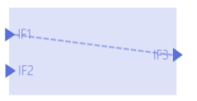

# Interfaces and connections

In DCF, two main concepts are defined: interfaces and connections.

## Interfaces

An interface can be thought of as the start or end point of a connection. Typically, there will be a DCF interface for every physical interface on a device, such as an Ethernet port or serial port.

Additional interfaces are often created to help visualize the internal connections and flow within a device or to facilitate switching logic (e.g. switching 1 connection instead of 10 connections). These are usually called virtual interfaces.

Within DataMiner, there is no actual distinction between a physical or virtual interface; both are simply considered to be an interface. However, different types of interfaces exist. DataMiner defines three types of interfaces based on the direction of the data flow:

- Input interface: Data can enter the DataMiner element from this interface.
- Output interface: Data can exit the DataMiner element from this interface.
- Inout interface: Data can both enter or exit the DataMiner element from this interface.

A virtual interface will always be defined as an inout type.

## Connections

A connection is a link between two interfaces.

Elements can have in/out interfaces, among which two types of connections can be established: internal and external connections. DataMiner is aware of this difference and internal logic will be different depending on the type of connection:

- Internal connections: Define a connection within the same element (e.g. matrix, switch, multiplexer, etc.). Internal connections always have a link from input interface to output interface, with inout interfaces being a wildcard.

    

- External connections: Define the interconnectivity between elements. External connections will always have a link from output interface to input interface, with inout interfaces being a wildcard.

    

## Properties

DCF provides the possibility to add properties to interfaces (e.g. the interface's IP address) and connections (e.g. a service name).

These properties are not intended for fast-changing data but for relatively static data that describes the interface.

Properties can be visualized in a Visio drawing, but they are also needed for advanced path selection and highlighting of connections when one input can lead to two or more outputs. They help DataMiner understand what path a specific package of data is following.

An interface that has a property with name [Linked Interface ID] is a virtual (“fake”) interface, with special behavior. The value of the property is an AgentId/ElementId/InterfaceId reference that points to an actual interface. Internally, it will then take the interface properties from the referenced interface and apply it to the virtual (fake) interface whenever you try to access these.
