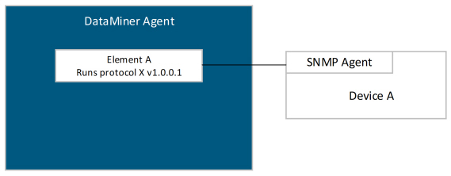

# Introduction

The Simple Network Management Protocol (SNMP) is a widely used application layer protocol for managing network elements.

The SNMP architectural model consists of network elements (e.g. routers, hosts, servers, etc.) and network management stations (NMS), e.g. a DataMiner Agent, that monitor and control the network elements. The SNMP protocol is used to communicate between the management stations and the network elements. The SNMP protocol is part of the Internet Standard Management Framework (which is also sometimes referred to as SNMP).

The Internet Standard Management Framework consists of the following components:

- Structure of Management Information (SMI): data definition language describing how managed objects present in the Management Information Base (MIB) are defined.
- Management Information Base (MIB): Managed objects are accessed via a virtual information store, the so-called Management Information Base (MIB).
- Simple Network Management Protocol (SNMP): Defines the protocol used to manage the objects contained in the MIB.
- Security and administration.

The NMS manages a network element by communicating with the network element using the SNMP protocol. The network element runs an SNMP Agent allowing to inspect (get) and alter (set) objects exposed by the MIB.

The management data that an SNMP Agent exposes (often referred to as managed objects or variables) are described by the Management Information Base (MIB). The MIB is a hierarchical structure containing object identifiers (OIDs), where each OID identifies a variable.

The name of a variable is an object identifier (OID), which is a concatenation of the object identifier of the corresponding object-type (the so-called object identifier prefix of the variable) and an object identifier fragment identifying the instance. For scalar objects, the instance will always be 0.

Three versions of SNMP are currently defined: SNMPv1, SNMPv2 and SNMPv3. DataMiner supports all three versions.

The following illustration displays a conceptual overview of a DataMiner Agent hosting an element running a protocol that communicates with a network element via SNMP.

Typically, a protocol with an SNMP connection contains logic to:

- Poll the device (i.e. inspect managed objects exposed by the MIB) by sending SNMP Get messages (e.g. GetNext, GetBulk).
- Change parameter values on the device by sending SNMP Set messages.
- Receive unsolicited SNMP traps from the device.

DataMiner runs a process called "SLSNMPManager" which controls all communication from and to devices running SNMP agents.

> [!NOTE]
>
> - For more information related to SNMP, refer to:
>    - http://www.snmp.com/protocol/snmp_rfcs.shtml
>    - https://www.rfc-editor.org/search/rfc_search_detail.php?title=SNMP&page=All
>    - http://www.snmplink.org 
>    - http://en.wikipedia.org/wiki/Simple_Network_Management_Protocol
> - Always verify that the correct security settings are filled in (e.g. community strings (SNMPv1, SNMPv2), username, authentication and privacy settings (SNMPv3)). From DataMiner 9.6.10 (RN 21458) onwards, a user is considered unique based on the following set of properties:
>    - User name
>    - Authentication protocol
>    - Authentication password
>    - Privacy protocol
>    - Privacy password

## Supported SNMPv3 authentication and encryption algorithms

The following authentication and encryption algorithms are supported in DataMiner:

- Encryption algorithms:
  - DES
  - AES128
  - AES192 (Since DataMiner 9.6.13 (RN 23586))
  - AES256 (Since DataMiner 9.6.13 (RN 23586))
- Authentication algorithms:
  - MD5
  - SHA128
  - SHA224 (Since DataMiner 9.6.13 (RN 23586))
  - SHA256 (Since DataMiner 9.6.13 (RN 23586))
  - SHA384 (Since DataMiner 9.6.13 (RN 23586))
  - SHA512 (Since DataMiner 9.6.13 (RN 23586))

> [!NOTE]
> When an encryption algorithm is used with more bits then the authentication type, this can cause issues. The following combinations are therefore not possible:
>
> - MD5 & AES192
> - MD5 & AES256
> - SHA128 & AES192
> - SHA128 & AES256
> - SHA224 & AES256
