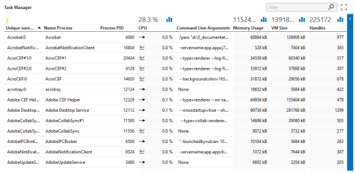

# Defining a table



To define a table, create a parameter of type "array" that represents the table.

Example:

```xml
<Param id="1000" trending="false">
  <Name>Table</Name>
  <Description>Table Description</Description>
  <Type>array</Type>
  <ArrayOptions index="0">
     <ColumnOption idx="0" pid="1001" type="retrieved" options=""/>
     <ColumnOption idx="1" pid="1002" type="retrieved" options=""/>
     <ColumnOption idx="2" pid="1003" type="retrieved" options=""/>
  </ArrayOptions>
  <Information>
     <Text>Table</Text>
     <Subtext></Subtext>
  </Information>
  ...
</Param>
```

The ArrayOptions tag contains all the columns (through ColumnOption child tags) that refer to other parameters (via the pid attribute).

For each table column, an additional parameter is defined.

```xml
<Param id="1001" trending="false">
  <Name>Column1</Name>
  <Description>Column 1 Description</Description>
  <Type>read</Type>
  ...
</Param>
<Param id="1002" trending="false">
  <Name>Column2</Name>
  <Description>Column 2 Description</Description>
  <Type>read</Type>
  ...
</Param>
```

> [!NOTE]
> Tables can also be used to hold data while the table should not be displayed on a page and should also not be available in the SLElement process. In case of such internal tables, it is important to set RTDisplay of the table parameter and the column parameters to "false" in order to avoid the table being loaded in the SLElement process.

The table parameter has an ArrayOptions tag that refers to the column parameters and defines the order of the columns (through the idx attribute).

> [!NOTE]
> The idx attribute defines the order in which the columns are stored. The order in which the columns are displayed can be different (this is defined in the options attribute of the Type tag in the Measurements tag).

In order to create a writable column, create an additional parameter of type "write".

```xml
<Param id="1102" trending="false">
  <Name>Column 2</Name>
  <Description>Column 2 Description</Description>
  <Type>write</Type>
  ...
</Param>
```

> [!NOTE]
>
> - Typically, a fixed offset is used between the parameter IDs of write parameters and the corresponding read parameters (e.g. 100 in the example above).
> - For more information about executing a QAction on a row change of a table, see Executing a QAction on a row change.
