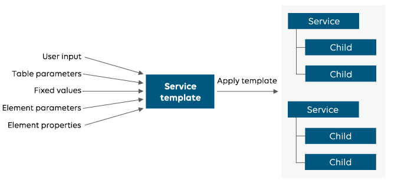

## About service templates

Service templates allow you to create entire series of almost identical services with just a few clicks. Creating a large number of very similar services can be a time-consuming and tedious job. However, by creating all services in one go with a service template, you can save a lot of time.

- [What is specified in a service template?](#what-is-specified-in-a-service-template)

- [Concept](#concept)

- [Examples](#examples)

#### What is specified in a service template?

In a service template, you have to specify

- The input data, i.e. all data that has to be supplied to the template (user input, element parameters, element properties, etc.)

- The child elements of the services to be created

- The properties of the services to be created

- Whether or not an SLA has to be linked to the services to be created

- The view to which to link the services to be created

#### Concept

The moment you apply a service template, it will collect all data that has been specified as “input data”, process it, and automatically create the services.

#### Examples

Below you will find examples of how to define a service template that will automatically create a service for every row in a dynamic table parameter of a certain type of element. The examples start from the following premise: for each of your “Microsoft Platform” elements, you want to create a service for every process of which the name starts with “SL”. Each of those services, named *\[computer model\]\_\[process\]*, has to include the CPU and the memory usage of the process in question.

- [Example of creating a service template](Creating_a_service_template.md#example-of-creating-a-service-template)

- [Example of applying a service template](Applying_service_templates.md#example-of-applying-a-service-template)
