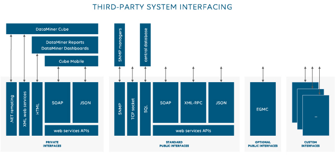

## DataMiner interfaces

Your DataMiner System can interface with a multitude of client applications, ranging from the standard DataMiner web clients to third-party tools.

### Graphical overview

As shown in the following illustration, there are four main categories of DataMiner interfaces.

 

### Private interfaces

Every DataMiner System ships with a number of private interfaces to connect to the standard DataMiner client applications.

#### Standard DataMiner web client (connecting via .NET Remoting or XML Web Services)

- DataMiner Cube

#### Standard DataMiner mobile client (connecting via the DataMiner Web Services APIs)

- DataMiner Monitoring & Control app (device-independent)

#### Standard DataMiner tools (connecting via .NET Remoting or XML Web Services)

- DMS Alerter

#### HTML-based reporting tools (connecting via HTML)

- DMS Reports

- DMS Dashboards

#### Custom apps, developed in-house (connecting via .NET Remoting or XML Web Services)

- Carrier Management

- IP Network Management

- Battery Management

- ...

### Standard public interfaces

By default, every DataMiner System has a number of standard public interfaces that allow:

- Forwarding of SNMP notifications to third-party SNMP managers (HP OpenView, IBM NetCool, etc.).

- Performing SNMP Get and SNMP Set requests on individual controls and readings of devices.

- Exchange of information via TCP-IP sockets.

- Offload of database records via SQL or NoSQL (Cassandra).

- Web Services APIs (SOAP XML, XML-RPC).

### Optional public interfaces

Optionally, your DataMiner System can be configured to connect to third-party applications via

- Web Services APIs (SOAP XML, XML-RPC, JSON)

- EGMC2

### Custom interfaces

On top of all available private and public interfaces, highly specialized, custom interfaces can be developed to allow your DataMiner System to integrate seamlessly into your existing infrastructure.

For more information, contact *[Skyline Sales](mailto:sales%40skyline.be)*.
