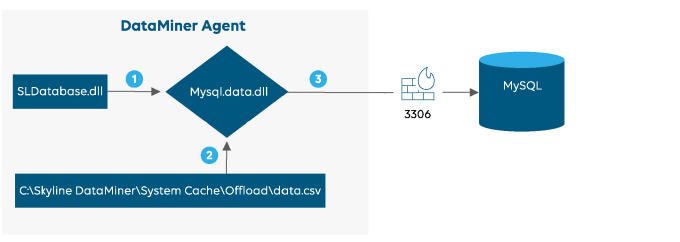
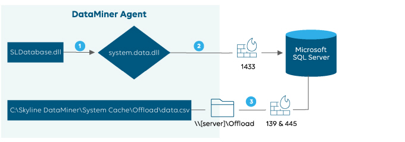
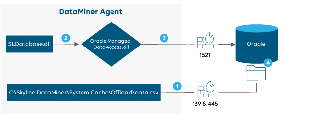

## How DataMiner offloads data

### Offload database of type MySQL

1. *SLDatabase.dll* orders *Mysql.data.dll* to load a CSV file into a particular database table by sending it the query to be executed.

    Example:

    ```txt
    LOADDATA LOCAL INFILE ‘C:\SKYLINE DATAMINER\SYSTEM CACHE\OFFLOAD\data.csv’INTO TABLE ALARM
    ```

2. *Mysql.data.dll* reads the CSV file.

3. *Mysql.data.dll* pushes the contents to the MySQL database via IP port 3306.




### Offload database of type Microsoft SQL Server

1. *SLDatabase.dll* orders *system.data.dll* to load a CSV file into a particular database table by sending it the query to be executed.

    Example:

    ```txt
    BULK INSERT ALARM FROM‘\\[DMAIP]\Offload’ WITH (DATAFILETYPE=’wildcard’, FIELDTERMINATOR = ‘\t’)
    ```

2. *system.data.dll* forwards the query to the SQL Server database via IP port 1433.

    See also: <https://msdn.microsoft.com/en-us/library/cc646023.aspx>

3. The SQL Server database fetches the CSV file from the shared folder on the DataMiner Agent via IP ports 139 and 445, and inserts the contents of the file into the table in question.

    See also: <https://technet.microsoft.com/en-us/library/cc731402(v=ws.11).aspx>




> [!NOTE]
> The folder *C:\\Skyline DataMiner\\System Cache\\Offload* has to be shared as “\\\\\[server\]\\Offload” with anonymous access.
>
> See also: [Configuring data offloads to an SQL Server database in another domain](../../part_7/SkylineDataminerFolder/DB_xml.md#configuring-data-offloads-to-an-sql-server-database-in-another-domain)

### Offload database of type Oracle

1. DataMiner copies the CSV file to be offloaded to the shared folder on the Oracle database server via IP ports 139 and 445.

    See also: <https://technet.microsoft.com/en-us/library/cc731402(v=ws.11).aspx>

2. SLDatabase.dll orders Oracle.ManagedDataAccess.dll to load the CSV file into a particular database table by sending it the queries to be executed.

    Example:

    ```txt
    CREATE TABLE ALARM_load + [definition] + LOCATION (‘[localPath in Db.xml]’)MERGE INTO ALARM USING (SELECT x FROM ALARM_load)…DROP TABLE ALARM_load
    ```

3. Oracle.ManagedDataAccess.dll forwards the queries to the Oracle database via IP port 1521.

    See also: [https://docs.oracle.com/cd/B19306_01/install.102/b15660/app_port.htm](https://docs.oracle.com/cd/B19306_01/install.102/b15660/app_port.md)

4. The Oracle database fetches the CSV file from its (local) shared, and inserts the contents of the file into the table in question.




> [!NOTE]
> - On the Oracle database server, a shared folder has to be created, the DataMiner Agents have to be granted access to that shared folder, and a *RemoteFileShare* tag has to be configured in the *DB.xml* file of the DataMiner server. See [Configuring data offloads to an Oracle database](../../part_7/SkylineDataminerFolder/DB_xml.md#configuring-data-offloads-to-an-oracle-database).
>
