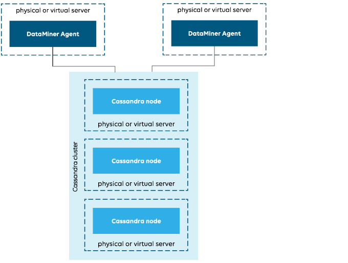

## Migrating the general database to a DMS Cassandra cluster

From DataMiner 10.1.0/10.1.2 onwards, you can use a single Cassandra cluster as the general database for the entire DataMiner System. Previously it was already possible to use a separate Cassandra cluster for each DataMiner node. However, DataMiner 10.1.0/10.1.2 introduces the “Cassandra cluster” feature, which allows you to have all DataMiner nodes in a DataMiner System use one and the same Cassandra cluster as their general database.

> [!TIP]
> See also:
> - [DMA in a DMS using a Cassandra cluster](../DataminerAgents/General_DMA_configuration.md#dma-in-a-dms-using-a-cassandra-cluster)
> - [General database settings](../../part_7/SkylineDataminerFolder/DB_xml.md#general-database-settings)

### Installation and configuration

#### Starting from an SQL setup

If your DataMiner System currently uses SQL databases, from DataMiner 10.2.0/10.2.1 onwards, you can use a migrator tool to switch to a Cassandra cluster setup. For more information, see [SQL to Cassandra Cluster migrator](https://community.dataminer.services/documentation/sql-to-cassandra-cluster-migrator/).

#### Starting from a Cassandra setup

If you are already using a Cassandra database for each DMA, to switch to using the Cassandra cluster feature for your DMS, follow the procedure below.

1. Make sure the Cassandra cluster software is installed on each DMA. A [standalone installer](https://community.dataminer.services/documentation/standalone-cassandra-cluster-installer/) is available for this on DataMiner Dojo.

2. Install DataMiner Indexing on each DMA in the cluster if you have not done so already. See [DataMiner Indexing Engine](DataMiner_Indexing_Engine.md).

3. Migrate the database data to the Cassandra cluster. A [Cassandra to Cassandra Cluster Migrator](https://community.dataminer.services/documentation/cassandra-to-cassandra-cluster-migrator/) tool is available for this on DataMiner Dojo.

    > [!NOTE]
    > We recommend that DataMiner is stopped before the migration is started. While it is possible to run the migration while DataMiner is running, any data that is stored in the source database during the migration may not be migrated to the target data­base.

4. In DataMiner Cube, go to *System Center* > *Database*.

5. On the *General* tab, select *Database per cluster* in the *Type* drop-down box.

6. Select *CassandraCluster* in the *Database* box, specify the name, DB server and credentials to connect to the Cassandra cluster, and click *Save*.

7. If Cassandra is no longer used on the DMA servers themselves, disable the Cassandra service:

    1. Run *services.msc*.

    2. In the *Services* window, right-click the *cassandra* service and select *Properties*.

    3. If the service is currently running, click the *Stop* button.

    4. In the *Startup type* box, select *Disabled*.

    5. Click *OK*.

8. Once you are sure you no longer need the old database data as a backup (e.g. a few months after the migration), remove the old database data folders (by default *C:\\ProgramData\\Cassandra\\SLDMADB* and *C:\\ProgramData\\Cassandra\\sldmadb_ticketing*).

### Limitations

- .dmimport packages created on a DMS using a Cassandra cluster do not contain any database data, and it is not possible to import database data from .dmimport packages into such a DMS.

- If the Cassandra cluster feature is used, alarm and information event information is always migrated to Elasticsearch. It is not possible to use this feature without enabling indexing on alarms.

### Cluster health monitoring

If a Cassandra node in the cluster goes down or if a Cassandra node is down when DataMiner starts up, an alarm will be generated in the Alarm Console. This alarm also indicates how much the health of the cluster is affected by the node being down, as this depends on multiple factors, including the cluster size and replication factor.

### Customizing the consistency level of the Cassandra cluster

When the Cassandra cluster feature is used, you can customize the consistency level for the Cassandra queries. You can do so as follows:

1. Shut down the DMA.

2. Open the file *DB.xml* from the directory *C:\\Skyline DataMiner* in a text editor.

3. In the \<Database> tag, add the *consistencyLevel=”x”* attribute, and set it to the consistency level you want, e.g. *two*.

    > [!NOTE]
    > - The following possible consistency levels are supported: Any, One, Two, Three, Quorum, All, LocalQuorum, EachQuorum, Serial, LocalSerial, LocalOn. For more information, see [https://docs.datastax.com/en/cassandra-oss/3.0/cassandra/dml/dmlConfigConsistency.html](https://docs.datastax.com/en/cassandra-oss/3.0/cassandra/dml/dmlConfigConsistency.md).
    > - The *consistencyLevel* attribute should only be changed in case the Cassandra cluster feature is used or a remote Cassandra server is used. If the standard configuration of one Cassandra cluster per DMA is used, changing this attribute can cause the DMA to fail to start up.
    > - Together with the replication factor, the consistency level determines the maximum number of nodes that can be down before data unavailability occurs. For example, if a replication factor of 3 and consistency level of 2 are used, Cassandra queries will require an answer from 2 out of 3 replicas to be considered successful. This means that if one node is down, queries will still succeed, but if another node is down, it is possible that queries will no longer succeed.

4. Restart DataMiner.
