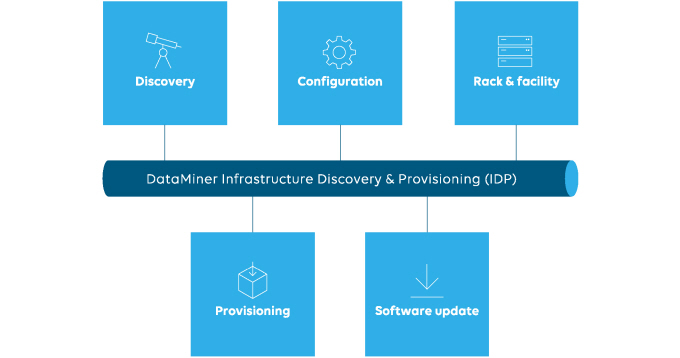

# DataMiner IDP app

DataMiner Infrastructure Discovery Provisioning (IDP) consists of several interacting components, each responsible for a specific task.

- The **Discovery Manager** automatically discovers inventory in the network as well as the network topology. Using highly user-configurable profiles and discovery mechanisms, such as SNMP, HTTP(S) and serial, the Discovery Manager can be tailored to detect not only new inventory, but it also identifies what type of inventory is in the network.

- The **Provisioning Manager** can automate the provisioning workflow completely. As soon as DataMiner IDP discovers new inventory, the IDP Provisioning Manager will provision the inventory in DataMiner fully automatically or semi-automatically.

- The **Configuration Manager**, introduced in IDP version 1.1.5, is responsible for storing configuration backups of the inventory and can be used to easily restore the default configuration of specific elements.

- The **Software Update Manager** allows users to upload an approved software image to elements and to signal elements that do not run the expected software version.

- The **Rack & Facility Manager** automatically creates the hierarchy of DataMiner rack views without any operator intervention. Using the element properties, the system understands how to represent an element in DataMiner Visual Overview, where to map the element in the DataMiner Surveyor hierarchy, and how to position it in the physical rack layouts in DataMiner.

This section contains the following information on DataMiner IDP:

- [Installing DataMiner IDP](Installing_DataMiner_IDP.md)

- [Using DataMiner IDP](Using_DataMiner_IDP.md)

- [Advanced configuration for Administrators](Advanced_configuration_for_Administrators.md)

- [Reference](Reference1.md#reference)
